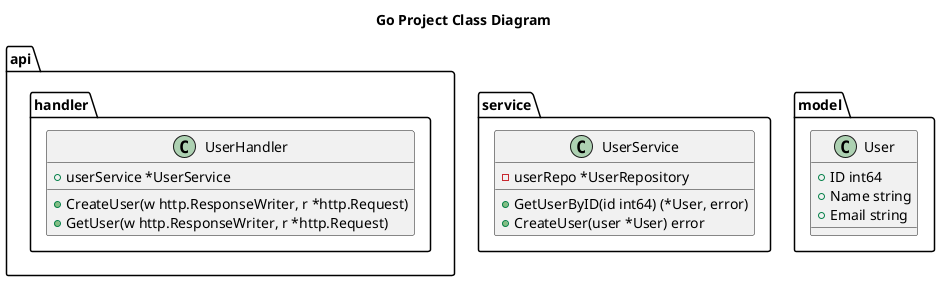

# uml-tools - Go UML Diagram Generator

[](https://golang.org)
[](LICENSE)

**uml-tools** 是一个 Go 语言编写的 UML 图表生成工具，可以从 Go 项目源代码自动生成 **类图 (Class Diagram)** 和 **包图 (Package Diagram)**。

## ✨ 特性

- 🎯 **类图生成** - 自动分析 Go 代码中的 struct 和 interface，生成 PlantUML/Mermaid 格式类图
- 📦 **包图生成** - 分析包之间的依赖关系，生成可视化包图
- 🎨 **双格式支持** - 支持 PlantUML 和 Mermaid 两种格式
- 🚀 **零依赖** - 仅使用 Go 标准库，无需额外安装
- 📊 **按包分类** - 类图使用 namespace 按包名分组显示

## 📦 安装

### 方式一：从源码编译

```bash
git clone git@github.com:ibreez3/uml-tools.git
cd uml-tools

# 编译类图工具
go build -o ulm-class ./cmd/class-diagram

# 编译包图工具
go build -o ulm-pkg ./cmd/package-diagram
```

### 方式二：使用 go install

```bash
go install github.com/ibreez3/uml-tools/cmd/ulm-class@latest
go install github.com/ibreez3/uml-tools/cmd/ulm-pkg@latest
```

## 🚀 使用方法

### 类图生成

```bash
# 生成 PlantUML 格式（默认）
./ulm-class -o classDiagram.puml /path/to/your/go-project

# 生成 Mermaid 格式
./ulm-class -format mermaid -o classDiagram.mmd /path/to/your/go-project

# 自定义标题
./ulm-class -title "My Project Class Diagram" -o output.puml /path/to/project
```

### 包图生成

```bash
# 生成 PlantUML 格式（默认）
./ulm-pkg -o packageDiagram.puml /path/to/your/go-project

# 生成 Mermaid 格式
./ulm-pkg -format mermaid -o packageDiagram.mmd /path/to/your/go-project

# 自定义标题
./ulm-pkg -title "My Project Package Diagram" -o output.puml /path/to/project
```

## 📋 命令行参数

### 类图工具 (ulm-class)

| 参数 | 说明 | 默认值 |
|------|------|--------|
| `-o` | 输出文件路径 | classDiagram.puml |
| `-title` | 图表标题 | Go Project Class Diagram |
| `-format` | 输出格式：plantuml 或 mermaid | plantuml |

### 包图工具 (ulm-pkg)

| 参数 | 说明 | 默认值 |
|------|------|--------|
| `-o` | 输出文件路径 | packageDiagram.puml |
| `-title` | 图表标题 | Go Project Package Diagram |
| `-format` | 输出格式：plantuml 或 mermaid | plantuml |

## 📊 输出示例

### 类图 (PlantUML)



### 包图 (PlantUML)

```plantuml
@startuml
title Go Project Package Diagram
skinparam packageStyle rectangle

package "api" as api {
  [5 struct(s)
   2 interface(s)
   10 func(s)]
}

package "service" as service {
  [3 struct(s)
   1 interface(s)
   8 func(s)]
}

package "model" as model {
  [8 struct(s)
   0 interface(s)
   0 func(s)]
}

api ..> service : imports
service ..> model : imports
@enduml
```

## 🔍 查看生成的图表

### PlantUML

- **在线查看**: [PlantText](https://www.planttext.com/)
- **VS Code 插件**: [PlantUML](https://marketplace.visualstudio.com/items?itemName=jebbs.plantuml)
- **命令行渲染**: `plantuml classDiagram.puml`

### Mermaid

- **在线查看**: [Mermaid Live Editor](https://mermaid.live/)
- **GitHub/GitLab**: 原生支持 Mermaid 代码块
- **Notion**: 原生支持 Mermaid
- **VS Code 插件**: [Markdown Preview Mermaid Support](https://marketplace.visualstudio.com/items?itemName=bierner.markdown-mermaid)

## 📁 项目结构

```
uml-tools/
├── cmd/
│   ├── class-diagram/     # 类图生成器
│   │   └── main.go
│   └── package-diagram/   # 包图生成器
│       └── main.go
├── go.mod
├── README.md
└── LICENSE
```

## ⚠️ 注意事项

1. **跳过的文件/目录**:
   - `*_test.go` 测试文件
   - `vendor/` 依赖目录
   - `.git/` Git 目录
   - `node_modules/` Node 依赖

2. **类图关系**: 自动生成的关系基于字段类型，复杂关系需手动补充

3. **包图依赖**: 仅显示项目内部包之间的依赖，不显示外部依赖

## 🛠️ 开发

```bash
# 运行测试（如果有）
go test ./...

# 格式化代码
go fmt ./...

# 编译所有工具
go build ./cmd/...
```

## 📝 License

MIT License - 详见 [LICENSE](LICENSE) 文件

## 🤝 贡献

欢迎提交 Issue 和 Pull Request！

## 📧 联系方式

- GitHub: [@ibreez3](https://github.com/ibreez3)
- Project: [uml-tools](https://github.com/ibreez3/uml-tools)
